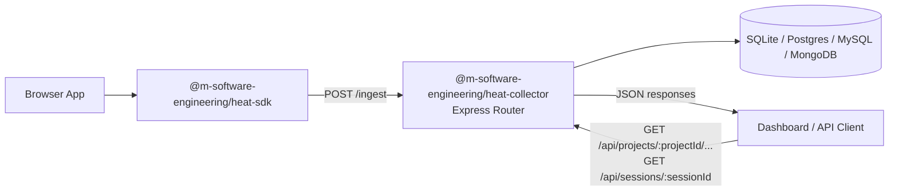
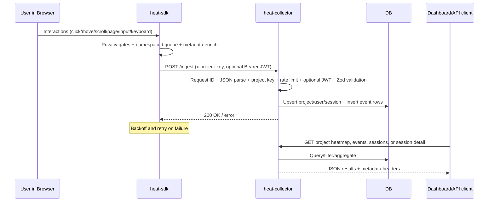

# heat-tracker Monorepo Architecture

## 1) Purpose

`heat-tracker` is an end-to-end product analytics stack that captures browser interaction events in a client SDK, ingests them through an HTTP collector, stores them in SQLite, Postgres, MySQL, or MongoDB, and exposes query APIs for heatmaps/session analysis and dashboards.

Primary goals observed in code:
- Browser-side event capture with privacy-aware defaults (`packages/heat-sdk`).
- Backend ingestion, validation, auth, persistence, and analytics APIs (`packages/heat-collector`).
- Runnable references for local stack + UI exploration (`examples/*`, `e2e/*`).

## 2) Monorepo map

| Path | Role |
|---|---|
| `packages/heat-sdk` | Browser SDK package (`@m-software-engineering/heat-sdk`). |
| `packages/heat-collector` | Express collector package (`@m-software-engineering/heat-collector`). |
| `examples/express-collector` | Minimal app that mounts collector router. |
| `examples/nextjs-dashboard` | Reference dashboard consuming collector APIs. |
| `examples/docker-compose` | Local MySQL/Postgres bootstrap for SQL adapter testing. |
| `e2e` | Playwright E2E validating SDK + collector integration. |
| `package.json` | Workspace-level build/test/lint/typecheck commands. |
| `pnpm-workspace.yaml` | Declares workspace packages under `packages/*` and `examples/*`. |

Discovered package roots for architecture docs:
- SDK: `packages/heat-sdk/ARCHITECTURE.md`
- Collector: `packages/heat-collector/ARCHITECTURE.md`

## 3) System architecture

Component responsibilities:
- **SDK**: capture click/move/scroll/pageview/custom (+ optional input/keyboard), apply privacy gates, namespace session/queue storage per project+endpoint, batch, retry/backoff, flush, and send payloads.
- **Collector**: assign request IDs before body parsing, validate payload/query schemas, enforce ingest auth/rate limits, write project/user/session/event rows, expose query endpoints and metrics.
- **Storage**: adapter pattern for SQL dialects and MongoDB.

## 4) Package relationships

- Dependency direction: `heat-sdk` is independent and publishes payloads over HTTP; `heat-collector` consumes those payload contracts via runtime validation (Zod). There is no direct package import from collector to SDK.
- Coupling boundary: the ingestion payload schema and event type semantics (`click`, `move`, `scroll`, etc.) are the primary contract.
- Integration appears intentionally loose (HTTP + schema), but schema drift risk exists because event types are duplicated between packages rather than centrally shared.

## 5) Data/control flow

## 6) Build and execution model

Workspace-level commands:
- `pnpm build`
- `pnpm dev`
- `pnpm typecheck`
- `pnpm lint`
- `pnpm test`
- `pnpm test:coverage`
- `pnpm test:e2e`

Package-level highlights:
- SDK and collector both use `tsup` for build and `vitest` for tests.
- Collector CLI binary: `heat-collector-migrate` (runs `autoMigrate` with env-based dialect/connection).

## 7) Patterns

- **Router composition**: collector returns `router`, `ingestRouter`, `apiRouter` for embedding flexibility.
- **Adapter-based persistence**: `createDb` and dialect-specific schema/migration paths.
- **Runtime schema validation**: ingestion and query validation via Zod.
- **Hook safety**: `hooks.onBeforeInsert` output is revalidated before persistence.
- **Operational metadata**: request IDs, structured logs, consistent error payloads, no-store headers.
- **Privacy-by-default capture**: SDK DNT respect, sensitive selector/input guards, allowlist modes that capture nothing without selectors, and private-target move filtering.
- **Resilience**: SDK storage fallback, namespaced queue persistence, multi-batch flush/shutdown draining, exponential backoff, and per-collector-instance rate limiting with bucket pruning.

## 8) Anti-patterns and risks

Concrete, source-based concerns:
- **Large single-module collector**: `packages/heat-collector/src/collector.ts` combines routing, auth, persistence orchestration, querying, and heatmap aggregation in one file, increasing change risk and cognitive load.
- **In-memory rate limit store**: buckets are scoped per collector instance and pruned, but are still process-local, not distributed-safe, and reset on restart.
- **Potential N+1 session counting**: `listSessions` computes event counts per session via repeated queries.
- **Dynamic `require` in schema module**: mixed module-loading style (`require(...)` inside TypeScript ESM context) may be brittle in some toolchains.
- **Unauthenticated query APIs by default**: project heatmap/events/sessions routes preserve existing compatibility and should be protected by the host app when needed.
- **No real linting**: both packages set `lint` script to echo placeholder, so style/static issues can slip through.
- **Contract duplication**: SDK event definitions and collector validation/event handling are maintained separately, creating drift risk.

## 9) Coding-agent guidance

Before changing behavior:
1. Read package docs: `packages/heat-sdk/ARCHITECTURE.md` and `packages/heat-collector/ARCHITECTURE.md`.
2. Verify payload contract alignment across:
   - `packages/heat-sdk/src/index.ts`
   - `packages/heat-collector/src/validation.ts`
   - `packages/heat-collector/src/collector.ts`
3. For SDK lifecycle, privacy, or micro-frontend changes, inspect storage namespace, storage fallback, multi-batch flush/shutdown, and shared History API patching.
4. For DB-impacting changes, inspect:
   - `packages/heat-collector/src/schema.ts`
   - `packages/heat-collector/src/db.ts`
   - collector tests + mongodb tests.
5. Run minimum validation:
   - unit tests for touched package(s), then root `pnpm test` when feasible.

Safe extension points:
- SDK: add event capture toggles/metadata in `InitConfig` + `TrackerImpl` handlers.
- Collector: add endpoints in `apiRouter`; extend query schemas in `validation.ts`.
- DB: extend `events.metaJson` usage for additive metadata with lower migration overhead.

Risky zones:
- `collector.ts` (cross-cutting logic density).
- session lifecycle + queue persistence semantics in SDK.
- auth/rate-limit/error-header behavior relied on by tests/clients.

## 10) Open questions

1. Should event contract types be extracted to a shared package to reduce drift?
2. Should rate limiting move to pluggable/distributed storage for multi-instance deployments?
3. Are there formal retention policies/PII guarantees beyond current defaults and best-effort masking?
4. Should query APIs gain optional non-breaking authentication middleware for deployments that expose them outside trusted networks?
