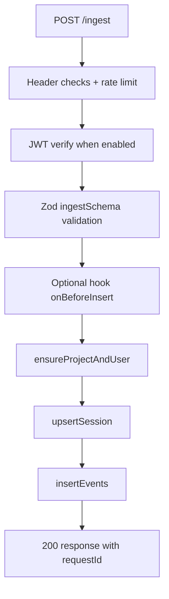

# heat-collector Architecture (`packages/heat-collector`)

## 1) Package purpose

`@m-software-engineering/heat-collector` is an embeddable Express collector that ingests SDK event batches, authenticates requests, validates payloads, persists analytics data to SQL or MongoDB, and serves query endpoints for heatmaps/events/sessions/metrics.

## 2) Runtime model

Runtime composition is centered on `createCollector(config)` in `src/collector.ts`.

Returned runtime components:
- `router`: full router (ingest + api).
- `ingestRouter`: ingestion endpoint(s).
- `apiRouter`: query/metrics endpoint(s).
- `metrics`: in-memory counters.

Startup lifecycle:
1. `createDb(config.db)` resolves adapter + schema.
2. `autoMigrate` runs by default (`autoMigrate ?? true`).
3. Middleware stack sets JSON body limit, request IDs, security headers, and request logging.
4. Routes handle ingest/query flows.

Shutdown behavior:
- No explicit shutdown API exposed by collector. Lifecycle is managed by host app/server process.

External dependencies:
- Express runtime.
- Drizzle ORM for SQL paths.
- MongoDB native driver for mongo paths.
- Optional peer DB drivers depending on dialect.

## 3) Integration with `heat-sdk`

Data contract and flow:
- SDK sends `POST /ingest` with `x-project-key`, optional `Authorization: Bearer ...`, and payload containing session/user/events.
- Collector validates with `ingestSchema` (`src/validation.ts`) before persistence.
- Event semantics expected from SDK:
  - `click`: uses `x/y`
  - `move`: expands `points[]` into row-per-point events
  - `scroll`: stores `scrollDepth`
  - others (`pageview/custom/input/keyboard`) store metadata and can be queried

Dependency direction:
- Collector does not import SDK package; integration is HTTP + schema compatibility.

Error propagation:
- Ingest/query failures return structured JSON payloads with `requestId` and stable error codes.
- SDK is expected to retry failed ingestion requests.

## 4) Internal architecture

Key modules:
- `src/collector.ts`: route handlers, auth flow, persistence orchestration, heatmap/event/session query shaping.
- `src/db.ts`: adapter factory + auto-migrations/index creation.
- `src/schema.ts`: dialect-specific table schemas + CREATE TABLE statements.
- `src/validation.ts`: Zod schemas for ingest and query validation.
- `src/jwt.ts`: RS256 JWT verification and JWKS caching.
- `src/logger.ts`: structured logger with level filtering.
- `src/metrics.ts`: in-memory metrics counters.
- `src/cli.ts`: `heat-collector-migrate` entry for migrations.

Boundary model:
- HTTP boundary (Express route layer).
- Validation boundary (Zod parse + typed query payloads).
- Storage boundary (DbContext abstraction with dialect switch).

## 5) Data collection flow

Event persistence behavior:
- `move` payload points are flattened to multiple event rows.
- `scroll` stores depth as integer.
- input events with non-masked leaked content are dropped as a safety guard.
- metadata JSON stores viewport/device/meta (sanitized to remove text/value/content fields).

Query flow (heatmap):
1. Validate query + parse time range.
2. Query rows by project/type/path/range.
3. Default behavior when `type` omitted: request `click`, fallback to `all` when no click rows.
4. Aggregate into resolution buckets and return metadata including plotted/ignored counts.

## 6) Configuration and environment

Config object (`CollectorConfig`):
- `db`: dialect and connection settings.
- `auth`: `projectKey`, `jwt`, or `both`.
- `autoMigrate`, `ingestion.maxBodyBytes`, `ingestion.rateLimit`.
- `hooks.onBeforeInsert`.
- `logging.level`.

CLI/migration env usage in `src/cli.ts`:
- `HEAT_DIALECT` (default `sqlite`)
- `DATABASE_URL`
- `SQLITE_FILE`
- `MONGODB_DATABASE`

Security/ops headers:
- `X-Request-Id`, `X-Heat-Collector`, `X-Content-Type-Options` on responses.
- rate-limit headers on ingest.

Secrets handling:
- JWT key material fetched from JWKS endpoint at runtime (cached in-memory).
- DB credentials expected in env/connection strings provided by host app.

## 7) Testing strategy

Discovered tests:
- `src/collector.test.ts`: SQLite integration tests via Express + supertest.
- `src/mongodb.test.ts`: fake Mongo implementation tests migration + API behavior.

Workspace integration coverage:
- `e2e/sdk.e2e.spec.ts` validates SDK-built artifact + collector ingestion/query roundtrip.

Recommended commands:
- `pnpm -C packages/heat-collector test`
- `pnpm -C packages/heat-collector test:coverage`
- `pnpm -C packages/heat-collector typecheck`
- `pnpm -C packages/heat-collector build`

## 8) Extension points

Safe paths:
- Add API route in `apiRouter` + matching schema in `validation.ts`.
- Add ingest pre-processing logic via `hooks.onBeforeInsert` for host-level customization.
- Extend storage fields through `metaJson` for additive metadata without immediate schema churn.

When adding new event types:
1. Update `eventSchema` union.
2. Update `insertEvents` handling.
3. Decide plottable behavior in `buildHeatmap`.
4. Add tests for ingest + query + fallback behavior.

## 9) Anti-patterns and risks

- **High file complexity**: `collector.ts` is doing too many responsibilities.
- **Process-local rate limiting** (`Map`) is not horizontally scalable.
- **Potential SQL N+1 in session listing** due to per-session event count query.
- **In-memory JWT/JWKS cache only**; multi-instance systems may fetch keys independently.
- **`any`-heavy DB abstractions** reduce type safety in persistence code.
- **No formal linting** (`lint` script placeholder) increases risk of drift/style inconsistency.

## 10) Coding-agent checklist

Before modifications:
- Inspect `collector.ts`, `validation.ts`, `db.ts`, and `schema.ts` together.
- Confirm SQL and Mongo paths are both covered for behavior changes.
- Check whether response header/error contract is externally relied upon.

After modifications:
- Run `pnpm -C packages/heat-collector test`.
- If integration behavior changed, run root `pnpm test` (includes e2e).
- Verify auth mode behavior (`projectKey` vs `jwt` vs `both`) if touching ingest auth path.
- Verify referenced file paths/modules in docs remain accurate.
